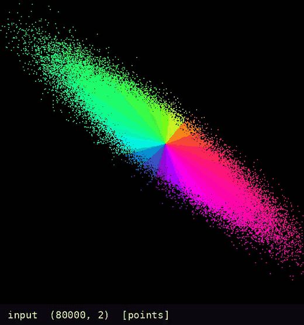

# jaxvis

Animate **any** JAX function by interpreting its jaxpr. Install once, then it
works on functions it has never seen.

```bash
pip install -e .
```

## An example: whitening



```python
tilted = rng.multivariate_normal([0.9, -0.5], [[2.2, 1.6], [1.6, 1.4]], n)
mu = tilted.mean(0)
chol = np.linalg.cholesky(np.cov(tilted.T))
unmix = np.linalg.inv(chol).T

ang = (np.arctan2(tilted[:, 1] - mu[1], tilted[:, 0] - mu[0]) + np.pi) / (2 * np.pi)
wheel = np.stack([np.sin(np.pi * ang), np.sin(np.pi * (ang + 1 / 3)),
                  np.sin(np.pi * (ang + 2 / 3))], 1) ** 2
wheel = wheel / wheel.max(1, keepdims=True)


@jaxvis.draw(jnp.asarray(tilted), palette="bloom", colors=wheel, blend="mean",
             frame="fixed", **cloud)
def whiten(x):
    return (x - mu) @ unmix
```

<br clear="all"/>

## Three ways in

```python
from jaxvis import visualize
visualize(my_fn, x, y, out="film.gif")
```

```python
from jaxvis import animate

@animate("attention.gif")
def attention(Q, K, V):
    ...
attention(Q, K, V)          # runs and returns normally, and writes the gif
```

```bash
jaxvis script.py out.gif    # script defines `fn` and `args`
```

## How it works

`jit`, `grad` and `vmap` are all interpreters over the jaxpr. This is one more —
it just draws.

```
trace_values   walk the jaxpr, bind each primitive, keep every intermediate
pick           choose a representation from the array's shape
morph          hold each canvas, cosine-ease into the next
save_gif       shared palette, no dither
```

## The engine picks the representation

| array | rep | |
|---|---|---|
| `(n, 2)` or `(n, 3)`, n >= 16 | **points** | particle cloud — the prettiest |
| `(b, h, w)` | **batch** | contact sheet |
| `(n, m)` | **heatmap** | grid, aspect preserved |
| `(n,)` | **strip** | one band |

Every renderer returns an `(S, S)` float in `[0,1]`. That shared type is why a
cross-fade works **even when the representation changes** mid-film.

## Knobs

```python
visualize(f, x,
          size=460,        # canvas
          hold=6,          # frames held per step
          tween=14,        # interpolated frames between steps
          palette="ember", # ember | ice | mono
          caption=True)    # op name + shape + chosen rep
```

## Extending

Add a renderer in `reps.py` returning `(S,S)` in `[0,1]`, then a rule in `pick()`.
Nothing else changes — morphing and saving are rep-agnostic.
